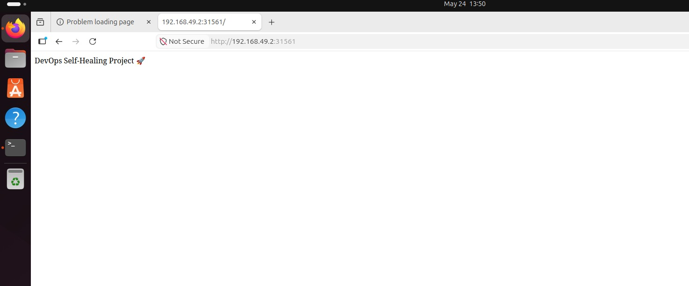
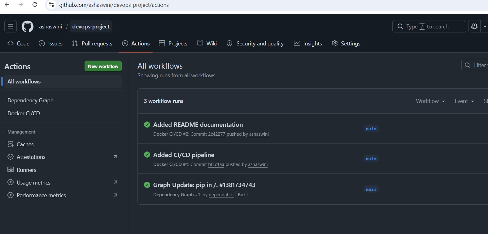
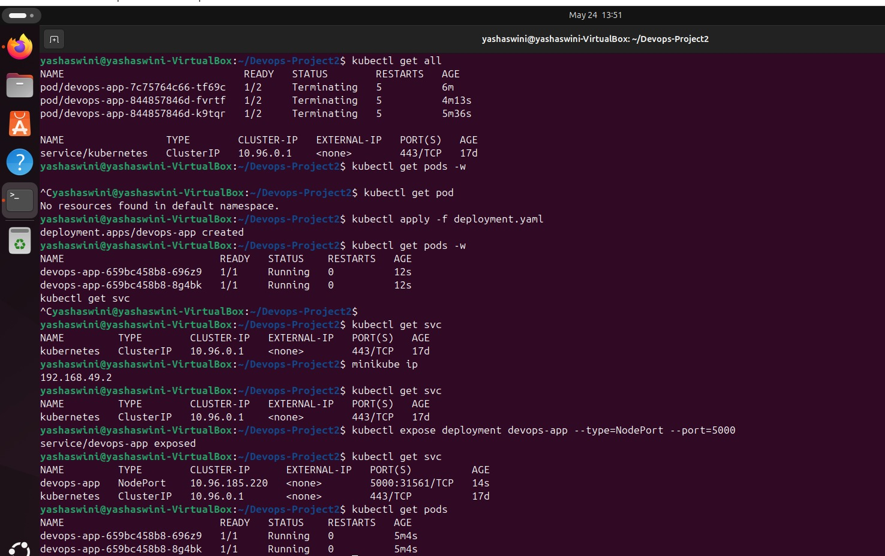

# DevOps End-to-End Project 🚀

## Project Overview
This project demonstrates an end-to-end DevOps workflow using Docker, Kubernetes, and GitHub Actions CI/CD pipeline.

The application is containerized using Docker, deployed on Kubernetes, and automated using GitHub Actions for continuous integration and continuous delivery.

---

## Technologies Used

- Python
- Flask
- Docker
- Kubernetes
- Minikube
- GitHub Actions
- Docker Hub
- YAML

---

## Features

- Dockerized Flask Application
- Kubernetes Deployment
- Self-Healing Pods
- Scaling using Replicas
- YAML-based Infrastructure
- Automated CI/CD Pipeline
- Docker Hub Integration

---

## Project Architecture

Developer → GitHub → GitHub Actions → Docker Hub → Kubernetes Cluster

---

## Docker Commands

### Build Docker Image
```bash
docker build -t <dockerhub-username>/devops-project:v1 .
```

### Run Container
```bash
docker run -d -p 5000:5000 <dockerhub-username>/devops-project:v1
```

---

## Kubernetes Commands

### Apply Deployment
```bash
kubectl apply -f deployment.yaml
```

### Check Pods
```bash
kubectl get pods
```

### Scale Deployment
```bash
kubectl scale deployment devops-app --replicas=3
```

---

## CI/CD Pipeline

GitHub Actions is used to:
- Automatically build Docker images
- Push images to Docker Hub
- Trigger pipeline on every push to main branch

---

## Learning Outcomes

- Containerization using Docker
- Kubernetes Deployment Management
- YAML Configuration
- Self-Healing in Kubernetes
- GitHub Actions CI/CD Automation

---

## Future Improvements

- Monitoring with Prometheus & Grafana
- Helm Charts
- Auto Scaling
- Cloud Deployment

---

## Screenshots

### Browser


### Docker Hub


### GitHub Actions


### Kubernetes


## Author

Yashaswini
